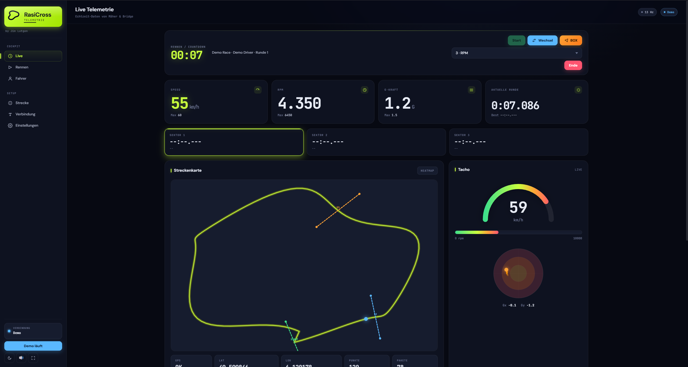

# RasiCross-Telemetrie

Live-Telemetrie für Kart- und Rasenmäher-Rennen ("RasiCross"). Zwei ESP32-Module funken Sensordaten kabellos vom Fahrzeug in die Boxengasse, ein Web-Dashboard visualisiert Geschwindigkeit, Drehzahl, GPS-Position, Beschleunigung, Rundenzeiten und Sektor-Splits in Echtzeit.



[](LICENSE)
[](https://github.com/Lutji06/RasiCross-Telemetrie/actions/workflows/build.yml)
[](https://github.com/Lutji06/RasiCross-Telemetrie/actions/workflows/check.yml)
[](https://github.com/Lutji06/RasiCross-Telemetrie/releases)

---

## Was kann das?

- **Kabellose Telemetrie** über ESP-NOW im Long-Range-Modus, ~250 kbit/s, mehrere hundert Meter Reichweite
- **Live-Anzeige** von Speed, RPM, Beschleunigung (Gx/Gy/**Gz**), **Gier-Rate**, GPS-Track und Funkqualität
- **Auto-Lap-Detection** über GPS-Geofence — keine externen Lichtschranken nötig
- **Sektor-Splits** mit Best-Time-Vergleich und Audio-Cues bei neuen Bestzeiten
- **Pit-Call** vom Dashboard direkt aufs OLED-Display im Cockpit
- **Live-Konfiguration** (Drehzahllimit, Sendezyklus, etc.) ohne Code-Änderung
- **Demo-Modus** zum Ausprobieren ohne Hardware
- **Plattformübergreifend** — Dashboard läuft im Browser oder als Desktop-App für Windows und macOS
- **In-App-Replay** — Telemetrie als NDJSON aufzeichnen und im Dashboard mit virtueller Uhr abspielen (Scrubber, 0,25×–4× Speed, Pause/Resume)
- **CSV-Export** — Aufnahmen als Excel-kompatible CSV exportieren (Semikolon-getrennt, ein Paket pro Zeile)
- **Ghost-Runde** — die beste Runde läuft als blasse Linie + Geister-Punkt live auf der Track-Karte mit
- **3D-Kart-Viewer** — Toggle zwischen 2D-G-Kreis und WebGL-3D-Kart, der sich live aus der IMU neigt (mit G-Vektor-Pfeil und Gz-Glow)
- **Eigenes 3D-Modell** — `.glb`/`.gltf` für den 3D-Viewer hochladen (Settings-Tab), ersetzt das Standard-Kart, persistent gespeichert
- **Batterie-Monitoring** — Live-Spannung/SOC/Zellenspannung, akustische Warnung bei niedrigem Stand
- **GPS-Ausfall-Fallback** — bei GPS-Verlust automatisch auf Radumfang-basierte Geschwindigkeit umschalten
- **Test-Suite** — 145 Unit-Tests (107 JS, 38 Python) laufen automatisch in CI bei jedem Push

---

## Inhaltsverzeichnis

- [Schnellstart für Endnutzer](#schnellstart-für-endnutzer)
- [Was du brauchst](#was-du-brauchst)
- [Komponenten im Überblick](#komponenten-im-überblick)
- [Hardware aufbauen](#hardware-aufbauen)
- [ESP32-Module flashen](#esp32-module-flashen)
- [Dashboard nutzen](#dashboard-nutzen)
- [Erweiterte Dashboard-Features](#erweiterte-dashboard-features)
- [Erstes Rennen fahren](#erstes-rennen-fahren)
- [Konfiguration anpassen](#konfiguration-anpassen)
- [Display-Seiten am Kart](#display-seiten-am-kart)
- [Bridge-Display](#bridge-display)
- [Status-LEDs](#status-leds)
- [Datenprotokoll](#datenprotokoll)
- [Fehlersuche](#fehlersuche)
- [Selbst bauen / Mitmachen](#selbst-bauen--mitmachen)
- [Lizenz](#lizenz)

---

## Schnellstart für Endnutzer

**Du willst nur das Dashboard nutzen, hast bereits Sender + Bridge bekommen?**

1. Auf der Releases-Seite die passende Datei herunterladen:
   - **Windows:** `RasiCross-Telemetry-Setup.exe` (Installer) oder `RasiCross-Telemetry-Portable.exe`
   - **macOS Apple Silicon (M1/M2/M3):** `RasiCross-Telemetry-arm64.zip`
   - **macOS Intel:** `RasiCross-Telemetry-x64.zip`

   Auf macOS: ZIP entpacken → `RasiCross Telemetry.app` in den Ordner
   "Programme" ziehen → starten. Beim ersten Start meldet macOS evtl.
   "Programm aus dem Internet" — über Rechtsklick → "Öffnen" lässt es sich
   trotzdem starten (oder in den Sicherheits-Einstellungen freigeben).

   👉 https://github.com/Lutji06/RasiCross-Telemetrie/releases/latest

2. Bridge-ESP per USB an den Computer stecken.

3. Beim Setup-Installer erscheint einmalig eine Admin-Abfrage (für die USB-Treiber). Bei der portablen Variante musst du den USB-Treiber ggf. selbst installieren — er liegt im Unterordner `drivers/`.

4. Anwendung starten, im Drop-down den COM-Port wählen, **"USB verbinden"** klicken. Sobald der Kart-ESP eingeschaltet ist, sind Live-Daten da.

> **Erste Windows-Warnung:** Windows zeigt beim ersten Start einen blauen SmartScreen-Bildschirm. Auf "Weitere Informationen" → "Trotzdem ausführen" klicken. Beim zweiten Mal kommt die Warnung nicht mehr.

> **Demo-Modus:** Wenn keine Hardware zur Hand ist, einfach im Dashboard auf den Demo-Button klicken — es erscheinen simulierte Telemetrie-Werte.

---

## Was du brauchst

### Software

- Releases-Datei für dein Betriebssystem (siehe oben), **oder**
- Browser mit Web-Serial-Unterstützung (Chrome, Edge, Brave) — dann das HTML direkt öffnen

### Hardware (zum Selber-Bauen)

**Pro Knoten (Kart und Bridge):**
- ESP32-Devkit mit MicroPython 1.21+ (z.B. ESP32-WROOM-32)
- SSD1306 OLED 128 × 64, I²C
- USB-Kabel zum Flashen / Stromversorgen

**Nur am Kart:**
- Hall-Sensor (z.B. A3144) am Schwungrad
- MPU-6050 (Beschleunigung)
- GPS-Modul mit NMEA (z.B. NEO-6M)

**Empfohlen:**
- Pufferakku am Kart gegen Spannungsspitzen
- Externe 2,4-GHz-Antennen für mehr Reichweite

Detaillierte Verkabelung mit Schaubild: **[docs/VERKABELUNG.md](docs/VERKABELUNG.md)**

---

## Komponenten im Überblick

```
   ┌──────────────────┐                       ┌──────────────────┐
   │   KART  (Sender) │   ESP-NOW (LR-Mode)   │  BRIDGE (Empf.)  │       ┌──────────────┐
   │                  │ ◄────────────────────►│                  │  USB  │  Dashboard   │
   │  ESP32 + OLED    │     2.4 GHz, CH 1     │  ESP32 + OLED    │ ◄───► │  (HTML/JS    │
   │  Hall · IMU · GPS│                       │                  │ JSON  │ oder Desktop)│
   └──────────────────┘                       └──────────────────┘ Lines └──────────────┘
```

| Komponente | Datei | Rolle |
| ---------- | ----- | ----- |
| Kart-Sender | `sender.py` | Sammelt Sensordaten (12,5 Hz) und sendet via ESP-NOW |
| Bridge | `bridge.py` | Empfängt vom Kart, gibt JSON-Lines auf USB |
| Dashboard | `RasiCross_Telemetry.html` | Visualisiert die Telemetrie im Browser |
| Desktop-App | `main.js`, `preload.js`, `package.json` | Verpackt das Dashboard als native Anwendung |

---

## Hardware aufbauen

Komplette Anleitung mit Pinbelegung, ASCII-Schaubild, Stromversorgung und Antennen-Tipps:

**👉 [docs/VERKABELUNG.md](docs/VERKABELUNG.md)**

Kurz-Übersicht der Pins (Standard, im `Config`-Block beider Skripte änderbar):

### Kart-Sender

| Funktion        | Pin (GPIO) | Bemerkung                                 |
| --------------- | ---------- | ----------------------------------------- |
| Hall-Sensor     | 4          | Input mit internem Pull-Up, Falling-IRQ   |
| GPS UART2 RX/TX | 16 / 17    | 9600 Baud, gekreuzt anschließen           |
| I²C SDA / SCL   | 21 / 22    | gemeinsam für IMU + OLED                  |
| Status-LED      | 2          | onboard                                   |

> ⚠️ **Nicht** GPIO 34/35/36/39 für den Hall-Sensor verwenden — diese
> Pins sind Input-only und haben **keine** internen Pull-Up-Widerstände.
> Der A3144 ist open-collector und braucht zwingend einen Pull-Up.

### Bridge

| Funktion       | Pin (GPIO) |
| -------------- | ---------- |
| I²C SDA / SCL  | 21 / 22    |
| Status-LED     | 2          |

---

## ESP32-Module flashen

> Diesen Schritt nur, wenn du Sender und Bridge selbst aufbauen willst. Wenn dir jemand zwei fertige ESP32-Module übergeben hat, kannst du diesen Abschnitt überspringen.

### 1. MicroPython auf den ESP32

Firmware von [micropython.org/download/ESP32_GENERIC](https://micropython.org/download/ESP32_GENERIC/) laden, dann:

```bash
esptool.py --chip esp32 --port /dev/ttyUSB0 erase_flash
esptool.py --chip esp32 --port /dev/ttyUSB0 --baud 460800 \
  write_flash -z 0x1000 esp32-XXXX.bin
```

**Wichtig:** MicroPython 1.21 oder neuer — `espnow` ist erst ab dieser Version dabei.

### 2. Sensor-Bibliotheken übertragen

Liegen im Ordner [`esp_libs/`](esp_libs/) — siehe auch [`esp_libs/README.md`](esp_libs/README.md).

**Auf den Kart-ESP:**

```bash
mpremote connect /dev/ttyUSB0 cp esp_libs/ssd1306.py :
mpremote connect /dev/ttyUSB0 cp esp_libs/mpu6050.py :
mpremote connect /dev/ttyUSB0 cp esp_libs/micropyGPS.py :
mpremote connect /dev/ttyUSB0 cp esp_libs/frame.py :
mpremote connect /dev/ttyUSB0 cp esp_libs/calc.py :
mpremote connect /dev/ttyUSB0 cp sender.py :main.py
```

**Auf den Bridge-ESP:**

```bash
mpremote connect /dev/ttyUSB1 cp esp_libs/ssd1306.py :
mpremote connect /dev/ttyUSB1 cp esp_libs/frame.py :
mpremote connect /dev/ttyUSB1 cp bridge.py :main.py
```

> ⚠️ `frame.py` (Binär-Protokoll) ist auf **beiden** ESPs Pflicht — ohne sie
> startet die Bridge nicht und der Sender kann keine Telemetrie senden.
> `calc.py` braucht nur der Sender (Batterie-Monitoring + Wheel-Speed-Fallback).

Bei OLED-Problemen hilft das Diagnose-Skript [`esp_libs/oled_diagnose.py`](esp_libs/oled_diagnose.py): in Thonny laden und in der REPL ausführen — es prüft I²C, OLED-Adresse und schreibt am Ende ein Test-Bild.

---

## Dashboard nutzen

### Variante A: Desktop-App (empfohlen)

Releases-Seite öffnen, fertige Datei herunterladen, starten — siehe [Schnellstart für Endnutzer](#schnellstart-für-endnutzer).

### Variante B: Im Browser

`RasiCross_Telemetry.html` direkt öffnen (Chrome, Edge oder Brave). Beim Klick auf "USB verbinden" fragt der Browser nach dem COM-Port.

> Web Serial funktioniert nur in Chromium-basierten Browsern. Firefox und Safari werden nicht unterstützt.

### Audio-Cues und Outdoor-Modus

Im Header oben rechts gibt es zwei Knöpfe:
- **◐** wechselt zwischen *dunkel*, *hell* und *outdoor* (hoher Kontrast bei direkter Sonneneinstrahlung in der Boxengasse)
- **🔊 / 🔇** schaltet Töne bei neuen Sektor- und Rundenbestzeiten an/aus

---

## Erweiterte Dashboard-Features

### Aufnahme und Replay

Jede Session lässt sich verlustfrei als NDJSON-Datei aufzeichnen und später im Dashboard erneut abspielen.

- **Auto-Arm:** Sobald die Bridge verbunden ist, beginnt die Aufnahme automatisch (in den Einstellungen abschaltbar).
- **Speichern:** Im Connection-Tab → *"Aufnahme speichern"* lädt eine `.ndjson`-Datei herunter (eine Telemetrie-Zeile pro Paket, Header in Zeile 1).
- **Laden:** Im selben Tab eine `.ndjson` auswählen → das Dashboard schaltet in den Replay-Modus.
- **CSV-Export:** *"CSV exportieren"* lädt die Aufnahme als `.csv` herunter — Semikolon-getrennt mit Dezimal-Komma (öffnet direkt in deutschem Excel), eine Telemetrie-Zeile pro Paket. Läuft gerade ein Replay, wird die geladene Aufnahme exportiert.
- **Transport-Leiste:** Unten am Bildschirm erscheint eine fixierte Leiste mit ⏵/⏸, Scrubber, Geschwindigkeitswahl (0,25× / 0,5× / 1× / 2× / 4×) und Beenden-Knopf. Live-Daten werden während Replay nicht aufgezeichnet (Session-State wird auf Replay-Enter sauber gesnapshotet und auf Exit restauriert).

### 3D-Kart-Viewer

In der G-Kraft-Karte gibt es einen kleinen **2D / 3D**-Toggle.

- **2D (Default):** der bekannte G-Kreis mit Trail.
- **3D:** ein WebGL-Kart-Modell, das sich live aus den IMU-Daten neigt. Pitch/Roll werden aus den Accel-Werten berechnet, Yaw aus der Gier-Rate integriert. Ein farbiger G-Vektor-Pfeil zeigt auf der Bodenplatte die Resultierende, ein vertikaler Balken neben dem Kart signalisiert Gz (vertikale Beschleunigung). Farbzonen: grün < 1 G, orange < 2 G, rot ≥ 2 G — wie beim 2D-Kreis.

Der Toggle-Zustand wird persistiert. Falls WebGL nicht verfügbar ist, fällt der Viewer transparent auf 2D zurück.

### Eigenes 3D-Modell hochladen

Im Settings-Tab → Karte *"Kart-Modell"* kann eine eigene `.glb` oder `.gltf` (max 10 MB) als Kart-Mesh hochgeladen werden.

- Modell wird automatisch in den passenden Maßstab skaliert und auf der Bodenplatte angeordnet.
- **Ausrichtung** lässt sich in 90°-Schritten (0° / 90° / 180° / 270°) nachjustieren, falls die Vorderachse nicht in +X zeigt.
- Persistent gespeichert (Electron `userData/karts/active.glb`) — wird beim nächsten Start automatisch geladen.
- *Zurücksetzen* stellt das Standard-Primitive-Kart wieder her.

### Karten-Hintergrund (OSM, offline-fähig)

Über der Track-Karte wird ein OpenStreetMap-Raster-Hintergrund eingeblendet,
sobald für eine Strecke Tiles vorliegen.

- **Auto-Cache:** Beim Klick auf *"Strecke speichern"* lädt das Dashboard im
  Hintergrund alle Tiles für die Streckengrenzen (Zoom 16–18, typisch
  40–80 Tiles, ~1–2 MB). Voraussetzung: Internet zum Zeitpunkt des
  Speicherns.
- **Offline:** Sobald die Tiles im Cache sind, wird die Karte komplett ohne
  Netzwerk gerendert — ideal für die Boxengasse ohne Empfang.
- **Manueller Refresh:** Im Strecken-Tab steht neben jeder Strecke ein
  *Tiles aktualisieren*-Knopf mit Status („Karte: 42/42 Tiles · 1,3 MB").
- **Live-Schalter:** Kleiner *M*-Knopf links oben auf der Live-Karte schaltet
  den Hintergrund während des Rennens an/aus.
- **Eigene Tile-URL:** In den Einstellungen → *"Karten-Hintergrund"* lässt sich
  eine eigene `{z}/{x}/{y}`-URL (z. B. MapTiler, Stadia, Carto) hinterlegen.
  Leer = OpenStreetMap Standard.
- **Cache leeren:** Settings → *"Cache leeren"* entfernt alle gecachten Tiles
  von der Festplatte (`userData/tiles/`).

> Karten © [OpenStreetMap-Mitwirkende](https://www.openstreetmap.org/copyright).
> Bei eigener Tile-URL gelten die Lizenzbedingungen des jeweiligen Anbieters.
> Die Browser-Variante (`RasiCross_Telemetry.html` direkt im Browser) hat
> dieses Feature nicht — es ist Desktop-App only.

### Live-Charts

Drei Verläufe synchronisiert über das Renn-Fenster:

- **Speed + RPM** (gemeinsame X-Achse, RPM rechte Y-Achse).
- **G-Kraft** mit drei Spuren: Gx (blau, längs), Gy (grün, lateral), Gz (orange, vertikal).
- **Yaw-Sparkline** als separater schmaler Verlauf direkt unter dem KPI für die Gier-Rate.

### Batterie

Wenn der Sender mit `BATT_CELLS > 0` konfiguriert ist (3S/4S/etc.), erscheint im Header eine **Batterie**-Kachel mit Volt, Prozent (SOC) und einem Farb-Indikator (grün → orange → rot). Akustische Warnung bei niedrigem Stand, einmaliger kritischer Cue bei Unterspannung.

---

## Erstes Rennen fahren

1. Beide ESP32 mit Strom versorgen.
2. Bridge per USB an den PC stecken, Dashboard öffnen, COM-Port wählen, "USB verbinden".
3. Auf dem Kart-OLED erscheint kurz das Boot-Bild, danach beginnt die Page-Rotation.
4. Im Dashboard taucht nach wenigen Sekunden die Bridge-MAC auf, dann die Kart-Daten.
5. GPS-Fix dauert beim Kaltstart oft 30–90 Sekunden (Status-LED am Kart blinkt solange).
6. **Strecke einmessen:** Im Dashboard zur Streckenverwaltung, "Track scannen" — eine Runde ruhig fahren, das Dashboard erkennt Start/Ziel automatisch und legt Sektor-Grenzen an. Strecke benennen und speichern.
7. **Rennen starten** im Dashboard. Sektor-Splits, Rundenzeiten und Live-Delta erscheinen automatisch.
8. **Pit-Call senden:** Knopf im Dashboard, Nachricht eintippen — sie erscheint blinkend auf dem OLED des Fahrers.

---

## Konfiguration anpassen

Viele Werte lassen sich **live aus dem Dashboard** ändern (Sektion Config), ohne neu zu flashen. Der Sender speichert sie im NVS-Flash — sie überleben also auch einen Neustart (z.B. Watchdog-Reset). Permanente Werte stehen in der `Config`-Klasse oben in jedem Skript.

### Sender (`sender.py`)

| Parameter           | Bedeutung                                | Default            |
| ------------------- | ---------------------------------------- | ------------------ |
| `BRIDGE_MAC`        | MAC-Adresse der Bridge                   | wird auto-gelernt  |
| `ESPNOW_CHANNEL`    | Funkkanal — Bridge und Sender gleich!    | `1`                |
| `PULSES_PER_REV`    | Hall-Pulse pro Umdrehung                 | `1`                |
| `SEND_MS`           | Telemetrie-Intervall (ms)                | `80` (12,5 Hz)     |
| `SEND_MS_DEGRADED`  | Bei schlechter Funkverbindung            | `200` (5 Hz)       |
| `MAX_RPM`           | Schwelle für Shift-Light                 | `6000`             |
| `RPM_WARN`          | Vorwarn-Schwelle                         | `5500`             |
| `WATCHDOG_MS`       | Hardware-Watchdog (0 = aus)              | `8000`             |
| `GPS_TIMEOUT_MS`    | Nach so vielen ms ohne Fix → "lost"      | `10000`            |
| `WIFI_TX_POWER_DBM` | Sendeleistung in dBm                     | `20` (EU-Max)      |
| `WHEEL_CIRC_M`      | Radumfang in m (0 = nur GPS-Speed)       | `0`                |
| `GEAR_RATIO`        | Wellenumdrehungen je Radumdrehung        | `1.0`              |
| `BATT_ADC_PIN`      | ADC1-Pin fürs Batterie-Monitoring (`None` = aus) | `34`       |
| `BATT_CELLS`        | LiPo-Zellen in Serie (Per-Cell + SOC)    | `1`                |

Live aus dem Dashboard änderbar: `max_rpm`, `warn_rpm`, `send_ms`, `pulses_per_rev`, `wheel_circ_m`, `gear_ratio`, `batt_cells`.

### Bridge (`bridge.py`)

| Parameter            | Bedeutung                            | Default |
| -------------------- | ------------------------------------ | ------- |
| `ESPNOW_CHANNEL`     | siehe oben                           | `1`     |
| `HEARTBEAT_MS`       | Status an Dashboard alle …           | `2000`  |
| `HELLO_MS`           | Hello an Kart alle … (max)           | `5000`  |
| `HELLO_QUIET_MS`     | Hello nur, wenn Kart so lange schweigt | `5000` |
| `WATCHDOG_MS`        | Hardware-Watchdog                    | `8000`  |

---

## Display-Seiten am Kart

Das OLED rotiert standardmäßig alle 4 s zwischen den fünf Seiten. Vom Dashboard kann eine Seite fest gewählt werden.

| Name    | Inhalt                                            |
| ------- | ------------------------------------------------- |
| `speed` | Geschwindigkeit groß zentriert, RPM-Bar unten     |
| `race`  | Sektor-Segmente und aktuelle Rundenzeit           |
| `rpm`   | Drehzahl groß + 8-Segment-Bar + Warnstufe         |
| `delta` | Live-Delta zur Referenzrunde                      |
| `diag`  | Diagnose: GPS-, TX-, Speed-, RPM-Status           |

**Overrides** (höchste Priorität zuerst):
1. **Pit-Call** — blinkende "PIT STOP"-Vollbildanzeige, vom Dashboard ausgelöst
2. **Shift-Alarm** — invertiertes "RELEASE THROTTLE", sobald `rpm ≥ MAX_RPM`

---

## Bridge-Display

Layout 128 × 64 px, zeigt Funk- und Verbindungszustand:

```
BRIDGE  CH1     1234   ●
─────────────────────────
 42 km/h   4280 rpm
 12 Hz     L:4
 -68 dBm   GPS:OK
USB ON     KT ee:ff
```

Aktivitätspunkt rechts oben: gefüllt = Paket gerade gekommen, leerer Rahmen = vor < 2 s, aus = keine Daten.

---

## Status-LEDs

### Kart

| Zustand               | LED            |
| --------------------- | -------------- |
| ESP-NOW sendet nicht  | aus            |
| TX ok, GPS sucht      | blinkt 500 ms  |
| TX ok, GPS-Fix        | dauerhaft an   |

### Bridge

| Zustand                          | LED            |
| -------------------------------- | -------------- |
| keine Pakete vom Kart            | aus            |
| Pakete kommen, USB nicht aktiv   | blinkt         |
| Pakete + USB verbunden           | dauerhaft an   |

---

## Datenprotokoll

Sämtliche Pakete sind UTF-8 JSON. Auf der ESP-NOW-Strecke werden sie binär verschickt; auf der USB-Seite zwischen Bridge und Dashboard erscheinen sie als JSON-Lines (eine Zeile pro Paket).

### Telemetrie-Paket (Kart → Bridge → Dashboard)

```json
{
  "speed": 42.3,
  "spd_src": "gps",
  "rpm": 4280,
  "gx": 0.12,
  "gy": -0.05,
  "gz": 0.98,
  "yaw": -12.4,
  "mtemp": 29,
  "lat": 48.1234567,
  "lon": 11.7654321,
  "gps_fix": 1,
  "gps_health": "ok",
  "pulse_hz": 71.3,
  "send_ms": 80,
  "seq": 1234,
  "vbat": 12.42,
  "soc": 78,
  "batt_warn": 0
}
```

`spd_src` ist `"gps"` oder `"wheel"` (Fallback bei GPS-Verlust, wenn `wheel_circ_m > 0`).
`gz`/`yaw`/`mtemp` sind die zusätzlichen IMU-Werte (Beschleunigung Z-Achse in G, Gier-Rate °/s, MPU-Temperatur °C). `vbat`/`soc`/`batt_warn` kommen nur bei aktivem Batterie-Monitoring (`batt_cells > 0`); `batt_warn` ist `0` (ok), `1` (low) oder `2` (kritisch).

Die Bridge ergänzt vor dem USB-Versand `rssi`, `rx_count`, `lost`, `bridge_ms`, `from_mac`.

### Bridge-Status (alle 2 s)

```json
{ "type": "bridge_status", "rate_hz": 12, "rx_count": 9821, "lost": 4, "kart_mac": "aa:bb:cc:dd:ee:ff" }
```

### Steuerpakete (Dashboard → Bridge → Kart)

| `type`            | Wirkung                                                          |
| ----------------- | ---------------------------------------------------------------- |
| `display`         | setzt Anzeigeseite (`speed`/`race`/`rpm`/`delta`/`diag`/`auto`)  |
| `config`          | Live-Parameter (`max_rpm`, `warn_rpm`, `send_ms`, `pulses_per_rev`, `wheel_circ_m`, `gear_ratio`, `batt_cells`) |
| `pit_call`        | löst Pit-Call-Override aus; `action: "cancel"` bricht ab         |
| `imu_calibrate`   | misst Gx/Gy-Nullpunkt (`action: "auto"`, `duration_ms`) und speichert die Offsets reboot-fest im Sender (NVS) |

---

## Fehlersuche

| Symptom                                              | Mögliche Ursache / Maßnahme                                  |
| ---------------------------------------------------- | ------------------------------------------------------------- |
| Bridge-OLED zeigt `USB OFF`                          | Dashboard noch nicht verbunden oder USB getrennt              |
| `RX-Count` bleibt 0                                  | `ESPNOW_CHANNEL` unterschiedlich? Bridge-MAC falsch? Antennen prüfen |
| `lost` zählt schnell hoch                            | Funkstörung, Reichweite überschritten, Antennenausrichtung    |
| Status-LED am Kart blinkt nie                        | LED-Pin korrekt? `LED_PIN` in Config prüfen                   |
| GPS-LED-Blinken hört nie auf                         | Freie Sicht zum Himmel? GPS-Pins korrekt?                     |
| `gps_health: "lost"` im Dashboard                    | NMEA-Daten kommen, aber kein Fix — Antennenstandort prüfen   |
| RPM bleibt 0 obwohl Welle dreht                      | Hall-Sensor verdrahtet? Magnet-Abstand? `PULSES_PER_REV`?     |
| OLED bleibt schwarz                                  | Diagnose-Skript `esp_libs/oled_diagnose.py` laufen lassen     |
| `bridge_error: invalid_json` im Dashboard            | korrumpierte Pakete — meist Funk-/Spannungsproblem            |
| Sender startet alle 8 s neu                          | Watchdog feuert — Endlosschleife/Hänger; `WATCHDOG_MS=0` zum Debug |
| SmartScreen-Warnung beim App-Start                   | Normal — auf "Weitere Informationen" → "Trotzdem ausführen"   |

**Strukturierte Logs** sind über die `Config.DEBUG`-Schalter beider Skripte aktivierbar.

---

## Selbst bauen / Mitmachen

> Dieser Abschnitt ist für Entwickler, die das Projekt erweitern oder die Desktop-App selbst bauen wollen.

### Desktop-App selbst bauen

**Voraussetzungen:** [Node.js](https://nodejs.org/) ≥ 18 LTS.

```bash
git clone https://github.com/Lutji06/RasiCross-Telemetrie.git
cd RasiCross-Telemetrie
npm install
npm start                # zum Testen
npm run build:win        # Windows-Installer + portable
npm run build:mac        # macOS .dmg fuer arm64 + x64
```

Unter Windows steht alternativ das Komfort-Skript [`BUILD_EXE.ps1`](BUILD_EXE.ps1) zur Verfügung — checkt Node.js, lädt fehlende USB-Treiber und ruft die Build-Pipeline auf.

### Release publizieren (Auto-Update)

Die installierte App (NSIS-Setup) prüft beim Start die GitHub-Releases und aktualisiert sich selbst (electron-updater). Damit das funktioniert, muss ein Release **mit `latest.yml`** publiziert werden — das übernimmt electron-builder:

```powershell
# 1. Version in package.json erhöhen (z.B. 9.7.0) und committen
# 2. GitHub-Token mit repo-Scope setzen und publizieren:
$env:GH_TOKEN = "ghp_..."
npx electron-builder --win --x64 --publish always
```

Das erstellt einen Release-Draft `v<version>` mit Setup-EXE, Portable-EXE und `latest.yml` — Draft auf GitHub veröffentlichen, fertig. Bestehende Installationen melden das Update beim nächsten Start („Update bereit") und installieren es beim Beenden. Die Portable-EXE und der Dev-Modus (`npm start`) aktualisieren sich nicht selbst.

### Automatisierte Builds

Bei jedem Tag-Push (`v*`) baut [`.github/workflows/build.yml`](.github/workflows/build.yml) Windows und macOS parallel und legt die Artefakte als GitHub-Release ab.

```bash
git tag v1.0.0
git push origin v1.0.0
```

### Tests + CI

Der pure Kern der App (Lap-/Sektor-Math in `geo.js`, Recording/Replay in `replay.js`, 3D-Helper in `karts3d.js`, Akku-Math in `esp_libs/calc.py`, Binär-Protokoll-Codec in `esp_libs/frame.py`) ist mit `node:test` und `unittest` abgedeckt; ESLint und Ruff prüfen zusätzlich auf toten Code und Fehler. Pre-Commit:

```bash
npm test                                                      # Unit-Tests (geo + replay + karts3d)
npm run lint                                                  # ESLint (JS-Quellen)
python -m unittest discover -s test -p "test_*.py"            # Unit-Tests (calc + frame)
ruff check                                                     # Ruff (sender/bridge/esp_libs/test)
node --check geo.js replay.js karts3d.js rasicross.js main.js preload.js map-draw.js races.js serial-demo.js gauges.js track.js laps-drivers.js live-ui.js pit-wall.js recording.js
python -m py_compile sender.py bridge.py esp_libs/*.py
```

[`.github/workflows/check.yml`](.github/workflows/check.yml) fährt dieselbe Pipeline bei jedem Push und PR.

### Beitrag leisten

Pull-Requests sind willkommen. Vorgehen, Code-Stil und Tipps in **[CONTRIBUTING.md](CONTRIBUTING.md)**.

### Code-Signing (optional)

Anleitung für kostenloses Windows-Code-Signing via SignPath: **[docs/CODE_SIGNING.md](docs/CODE_SIGNING.md)**.

---

## Lizenz

[MIT-Lizenz](LICENSE) — kostenlose Nutzung, Modifikation und Verbreitung erlaubt, ohne Gewährleistung.

Treiber und Bibliotheken Dritter haben eigene Lizenzen:

- `drivers/CP210xVCPInstaller_x64.exe` — Silicon Labs (proprietär, frei verteilbar)
- `esp_libs/ssd1306.py` — MicroPython, MIT
- `esp_libs/mpu6050.py` — MIT
- `esp_libs/micropyGPS.py` — MIT (kompakter NMEA-Parser, kompatibel zur inmcm/micropyGPS-API)
