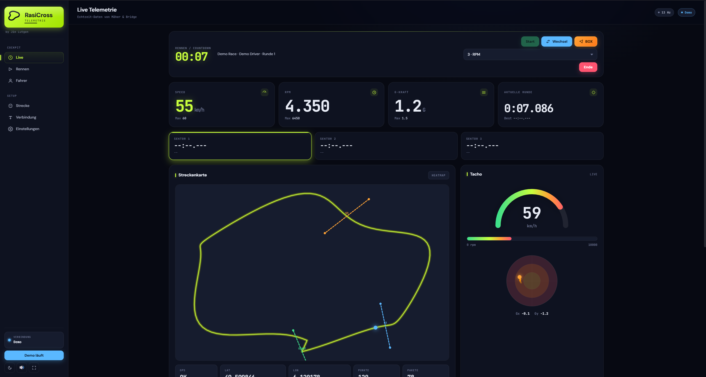

# RasiCross-Telemetrie

Live-Telemetrie für Kart- und Rasenmäher-Rennen („RasiCross"). Ein ESP32 am Fahrzeug funkt Sensordaten kabellos in die Boxengasse, ein zweiter am USB-Port nimmt sie entgegen, und eine Desktop-App zeigt Geschwindigkeit, Drehzahl, GPS-Position, Beschleunigung, Rundenzeiten und Sektor-Splits in Echtzeit — für bis zu vier Fahrzeuge gleichzeitig.



[](LICENSE)
[](https://github.com/Lutji06/RasiCross-Telemetrie/actions/workflows/build.yml)
[](https://github.com/Lutji06/RasiCross-Telemetrie/actions/workflows/check.yml)
[](https://github.com/Lutji06/RasiCross-Telemetrie/releases)

---

## Wo willst du hin?

| Dein Ziel | Lies das |
| --- | --- |
| **Nur fahren** — du hast fertige Module bekommen | [Schnellstart](#schnellstart) |
| **Selbst bauen** — Hardware löten und flashen | [Hardware](#hardware) · [ESP32 flashen](#esp32-flashen) |
| **Verstehen** — was die App alles kann | [Die App](#die-app) |
| **Mitentwickeln** | [Entwicklung](#entwicklung) · [CONTRIBUTING.md](CONTRIBUTING.md) |
| **Etwas geht nicht** | [Fehlersuche](#fehlersuche) |

---

## Schnellstart

**Kein Hardware-Zugriff nötig:** Lade die App, starte sie und klicke auf den **Demo**-Knopf im Verbindungs-Tab. Drei simulierte Karts fahren ein Rennen — damit lässt sich alles außer der IMU-Einbaulage ausprobieren.

**Mit Hardware:**

1. Passende Datei von der [Releases-Seite](https://github.com/Lutji06/RasiCross-Telemetrie/releases/latest) laden:
   - **Windows:** `RasiCross-Telemetry-Setup.exe` (Installer) oder `…-Portable.exe`
   - **macOS Apple Silicon:** `RasiCross-Telemetry-arm64.zip` · **Intel:** `…-x64.zip`
2. Bridge-ESP per USB anstecken.
3. App starten → Tab **Verbindung** → COM-Port wählen → **USB verbinden**.
4. Kart-ESP einschalten. Sobald Pakete ankommen, erscheint das Kart in der Leiste.

> **Windows-SmartScreen** meldet beim ersten Start eine unbekannte App: „Weitere Informationen" → „Trotzdem ausführen". Danach nicht mehr.
>
> **macOS** meldet „Programm aus dem Internet": Rechtsklick auf die App → „Öffnen".
>
> **USB-Treiber:** Der Installer bringt ihn mit (einmalige Admin-Abfrage). Bei der portablen Variante liegt er in `drivers/`.

---

## Wie es zusammenhängt

```
   ┌───────────────────────┐                         ┌──────────────────┐
   │  KART  (Sender)       │    ESP-NOW (LR-Mode)    │  BRIDGE          │      ┌──────────────┐
   │  ESP32                │ ◄──────────────────────►│  ESP32           │ USB  │  Desktop-App │
   │  Hall · MPU-6050 · GPS│   2,4 GHz, Kanal 1      │                  │ ◄───►│  (Electron)  │
   └───────────────────────┘   Binärframe, 12,5 Hz   └──────────────────┘ JSON └──────────────┘
        bis zu 4 Karts                                                    Lines
```

| Teil | Datei | Rolle |
| --- | --- | --- |
| Kart-Sender | `sender.py` + `esp_libs/` | Sammelt Sensordaten mit 12,5 Hz, sendet per ESP-NOW |
| Bridge | `bridge.py` + `esp_libs/frame.py` | Empfängt von bis zu 4 Karts, gibt JSON-Zeilen auf USB |
| Oberfläche | `index.html`, `src/*.js` (44 ESM-Module) | Auswertung und Darstellung |
| Desktop-Hülle | `main.js`, `preload.js` | Electron-Fenster, serieller Port, Datei-Ablage |

Die Oberfläche wird mit **Vite** gebaut. Eine einzelne, direkt im Browser aufrufbare HTML-Datei gibt es nicht mehr — für den Browser-Betrieb siehe [Entwicklung](#entwicklung).

---

## Hardware

**Pro Knoten (Kart und Bridge):** ESP32-Devkit (z. B. ESP32-WROOM-32) mit MicroPython 1.21+, USB-Kabel.

**Zusätzlich am Kart:** Hall-Sensor (z. B. A3144) am Schwungrad, MPU-6050 (Beschleunigung + Gyro), GPS-Modul mit NMEA (z. B. NEO-6M).

**Empfohlen:** Pufferakku am Kart gegen Spannungsspitzen, externe 2,4-GHz-Antennen für Reichweite.

Pinbelegung (Standard, im `Config`-Block änderbar):

| Funktion | GPIO | Bemerkung |
| --- | --- | --- |
| Hall-Sensor | 4 | Input mit internem Pull-Up, Falling-IRQ |
| GPS UART2 RX/TX | 16 / 17 | 9600 Baud, gekreuzt anschließen |
| I²C SDA / SCL | 21 / 22 | MPU-6050 |
| Status-LED | 2 | onboard (Kart und Bridge) |

> ⚠️ **Nicht** GPIO 34/35/36/39 für den Hall-Sensor: Diese Pins sind Input-only und haben **keine** internen Pull-Ups. Der A3144 ist open-collector und braucht zwingend einen.

Vollständige Verkabelung mit Schaubild und Stromversorgung: **[docs/VERKABELUNG.md](docs/VERKABELUNG.md)**

---

## ESP32 flashen

> Nur nötig, wenn du die Module selbst aufbaust.

### 1. MicroPython

```bash
esptool.py --chip esp32 --port COM3 erase_flash
esptool.py --chip esp32 --port COM3 --baud 460800 write_flash -z 0x1000 esp32-XXXX.bin
```

Firmware: [micropython.org/download/ESP32_GENERIC](https://micropython.org/download/ESP32_GENERIC/) — **Version 1.21 oder neuer**, `espnow` und die RSSI-Auswertung gibt es erst ab dann.

### 2. Programm vorkompilieren — Pflicht

> ⛔ **`sender.py` und `bridge.py` dürfen NICHT als `.py` nach `main.py` kopiert werden.**
>
> MicroPython übersetzt `main.py` beim Booten auf dem Chip. Bei Dateien dieser Größe wächst der Python-Heap dabei genau in die DRAM-Region, aus der der WiFi-Treiber seine Puffer nimmt — der ESP stirbt mit `OSError: WiFi Out of Memory` und hängt in einer Watchdog-Bootschleife. Vorkompilierter Bytecode braucht beim Laden einen Bruchteil des RAMs und umgeht das Problem.

```bash
pip install mpy-cross
python -m mpy_cross -o app.mpy sender.py     # für den Kart-ESP
python -m mpy_cross -o app.mpy bridge.py     # für die Bridge — separat!
```

Auf dem Gerät liegt dann `app.mpy` plus das Mini-`main.py` aus [`esp_libs/main_stub.py`](esp_libs/main_stub.py), das nur `import app` enthält.

### 3. Übertragen

```bash
# ── Kart-ESP ── (alles aus dem Projekt-Wurzelverzeichnis)
python -m mpy_cross -o app.mpy sender.py
mpremote connect COM3 cp esp_libs/mpu6050.py :mpu6050.py
mpremote connect COM3 cp esp_libs/micropyGPS.py :micropyGPS.py
mpremote connect COM3 cp esp_libs/frame.py :frame.py
mpremote connect COM3 cp esp_libs/calc.py :calc.py
mpremote connect COM3 cp esp_libs/config_store.py :config_store.py
mpremote connect COM3 cp esp_libs/radio.py :radio.py
mpremote connect COM3 cp esp_libs/imu_task.py :imu_task.py
mpremote connect COM3 cp esp_libs/gps_task.py :gps_task.py
mpremote connect COM3 cp app.mpy :app.mpy
mpremote connect COM3 cp esp_libs/main_stub.py :main.py

# ── Bridge-ESP ──
python -m mpy_cross -o app.mpy bridge.py
mpremote connect COM4 cp esp_libs/frame.py :frame.py
mpremote connect COM4 cp app.mpy :app.mpy
mpremote connect COM4 cp esp_libs/main_stub.py :main.py
```

`frame.py` (Binärprotokoll) ist auf **beiden** ESPs Pflicht — ohne sie startet die Bridge nicht und der Sender schickt nichts.

Details, Thonny-Weg und die Rettung aus einer Crash-Schleife: **[esp_libs/README.md](esp_libs/README.md)**

---

## Die App

Acht Tabs, links in der Seitenleiste:

| Tab | Inhalt |
| --- | --- |
| **Live** | Tacho, Drehzahl, G-Meter, Streckenkarte, Rundenzeiten. Bei mehreren Karts eine Übersicht, per Klick auf eine Karte die Einzelansicht. |
| **Detail** | Verlauf, Stints und Rundentabelle des laufenden Rennens. |
| **Rennen** | Rennen anlegen, starten, auswerten. |
| **Fahrer** | Fahrerverwaltung, Statistiken, Gesamtstrecke. |
| **Karts** | Flotte und Wartung: Status je Kart, Motorstunden, Kalibrierung. |
| **Strecke** | Strecke einmessen, Sektoren setzen, Strecken speichern. |
| **Verbindung** | COM-Port, Demo-Modus, Aufzeichnung, Diagnose. |
| **Einstellungen** | Skalen, Kalibrierung, ESP32-Konfiguration, Datenverwaltung. |

### Mehrere Karts

Bis zu **vier Karts** gleichzeitig. Jedes meldet sich mit eigener MAC an, bekommt Name und Farbe und wird in der Kart-Leiste geführt. Rundenzeiten, Sektoren, Motorstunden und Kalibrierung laufen pro Kart getrennt. Über das ⚙ auf einer Kart-Karte öffnet sich ein **eigenes Fenster** für dieses Kart — praktisch auf einem zweiten Bildschirm in der Box.

### Runden und Sektoren

Die Rundenerkennung läuft über einen GPS-Geofence — **keine Lichtschranke nötig**. Eine Runde ruhig fahren, das Dashboard erkennt Start/Ziel und legt Sektorgrenzen an. Sektor-Bestzeiten gelten je Rennen; neue Bestzeiten quittiert ein Ton.

### Fahrzeuglage

Aus Beschleunigung und Gierrate berechnet die App den Rollwinkel (Komplementärfilter). Bei einem **echten Überschlag** (Standard ab 75°) warnt sie akustisch und im Bild — normales Radheben in der Kurve löst bewusst nicht aus.

Die IMU muss nicht in Fahrtrichtung eingebaut sein: Im Kart-Fenster unter *Kalibrierung* lassen sich Nullpunkt, Achsentausch, einzelne Vorzeichen und die Einbaulage **kopfüber** einstellen. Weil die Korrektur erst beim Auswerten greift, wirkt sie auch rückwirkend auf schon aufgezeichnete Fahrten.

### Aufzeichnen und Abspielen

Jede Session lässt sich als NDJSON aufzeichnen und später abspielen — mit Transportleiste, Scrubber und 0,25×–4×. Zusätzlich **CSV-Export** (Semikolon, Dezimalkomma — öffnet direkt in deutschem Excel). Die Aufnahme startet automatisch, sobald die Bridge verbunden ist (abschaltbar).

### Karte, Charts, 3D

- **Streckenkarte** mit OpenStreetMap-Hintergrund. Beim Speichern einer Strecke lädt die App die Kacheln in den lokalen Cache — danach funktioniert die Karte **offline**, ideal für eine Boxengasse ohne Empfang. Eigene Tile-URL möglich.
- **Ghost-Runde:** Die beste Runde läuft als blasse Linie mit Geisterpunkt live mit.
- **Live-Charts:** Speed + Drehzahl auf gemeinsamer Zeitachse, G-Kräfte in drei Spuren, Gierrate als Sparkline.
- **3D-Kart:** Umschalter am G-Meter zwischen 2D-Kreis und einem WebGL-Kart, das sich live neigt. Eigenes `.glb`/`.gltf`-Modell hochladbar. Ohne WebGL fällt die Ansicht still auf 2D zurück.
- **Batterie:** Bei konfiguriertem Monitoring Spannung, Ladestand und Warnton bei Unterspannung.

### Bedienung

Kopfzeile rechts: **◐** schaltet zwischen dunkel, hell und *outdoor* (hoher Kontrast bei Sonne), **🔊** schaltet die Töne. Beides wird gespeichert. Die Oberfläche respektiert die Systemeinstellung „Bewegung reduzieren" — dann springen Übergänge sofort, statt zu federn.

---

## Erstes Rennen

1. Beide ESP32 mit Strom versorgen, Bridge per USB anstecken, verbinden.
2. Auf GPS-Fix warten — beim Kaltstart 30–90 s (die Kart-LED blinkt solange).
3. **Strecke einmessen:** Tab *Strecke* → „Track scannen" → eine ruhige Runde fahren → benennen und speichern.
4. **Rennen anlegen und starten** im Tab *Rennen*. Sektor-Splits, Rundenzeiten und Delta erscheinen automatisch.

---

## Konfiguration

Viele Werte lassen sich **live aus der App** ändern, ohne neu zu flashen; der Sender legt sie im NVS-Flash ab, sie überstehen also auch einen Watchdog-Reset. Die fest eingebauten Vorgaben stehen in der `Config`-Klasse — beim Sender in [`esp_libs/config_store.py`](esp_libs/config_store.py), bei der Bridge oben in `bridge.py`.

### Sender

| Parameter | Bedeutung | Default |
| --- | --- | --- |
| `BRIDGE_MAC` | MAC der Bridge | wird automatisch gelernt |
| `ESPNOW_CHANNEL` | Funkkanal — bei Sender und Bridge gleich! | `1` |
| `PULSES_PER_REV` | Hall-Pulse je Umdrehung | `1` |
| `SEND_MS` | Sendeintervall | `80` (12,5 Hz) |
| `SEND_MS_DEGRADED` | bei schlechter Funkverbindung | `200` (5 Hz) |
| `WATCHDOG_MS` | Hardware-Watchdog (0 = aus) | `8000` |
| `GPS_TIMEOUT_MS` | ohne Fix so lange → „lost" | `10000` |
| `WIFI_TX_POWER_DBM` | Sendeleistung | `20` (EU-Maximum) |
| `WHEEL_CIRC_M` | Radumfang in m (0 = nur GPS-Speed) | `0` |
| `GEAR_RATIO` | Wellenumdrehungen je Radumdrehung | `1.0` |
| `BATT_ADC_PIN` | ADC1-Pin fürs Batterie-Monitoring (`None` = aus) | `34` |
| `BATT_CELLS` | LiPo-Zellen in Serie | `1` |

Live änderbar: `send_ms`, `pulses_per_rev`, `wheel_circ_m`, `gear_ratio`, `batt_cells`, `batt_warn_v`, `batt_crit_v`, `batt_cal`, `rpm_ceiling`, `rpm_alpha`.

### Bridge

| Parameter | Bedeutung | Default |
| --- | --- | --- |
| `ESPNOW_CHANNEL` | siehe oben | `1` |
| `HEARTBEAT_MS` | Status an die App alle … | `2000` |
| `HELLO_MS` | Hello ans Kart alle … (max) | `5000` |
| `HELLO_QUIET_MS` | Hello nur, wenn das Kart so lange schweigt | `5000` |
| `WATCHDOG_MS` | Hardware-Watchdog | `8000` |

### Status-LEDs

| | aus | blinkt | dauerhaft an |
| --- | --- | --- | --- |
| **Kart** | ESP-NOW sendet nicht | TX ok, GPS sucht | TX ok, GPS-Fix |
| **Bridge** | keine Pakete vom Kart | Pakete da, USB inaktiv | Pakete + USB verbunden |

---

## Datenprotokoll

Auf der Funkstrecke fahren die Pakete binär; zwischen Bridge und App sind es UTF-8-JSON-Zeilen (eine pro Paket).

**Telemetrie (Kart → Bridge → App)**

```json
{
  "speed": 42.3, "spd_src": "gps", "rpm": 4280,
  "gx": 0.12, "gy": -0.05, "gz": 0.98, "yaw": -12.4, "roll": 1.8,
  "mtemp": 29,
  "lat": 48.1234567, "lon": 11.7654321, "gps_fix": 1, "gps_health": "ok",
  "pulse_hz": 71.3, "send_ms": 80, "seq": 1234,
  "vbat": 12.42, "soc": 78, "batt_warn": 0
}
```

- `spd_src` ist `"gps"` oder `"wheel"` (Fallback bei GPS-Verlust, wenn `wheel_circ_m > 0`).
- `gx`/`gy`/`gz` sind Beschleunigungen in g, `yaw` die Gierrate und `roll` die Rollrate in °/s, `mtemp` die Chiptemperatur der IMU.
- `vbat`/`soc`/`batt_warn` nur bei aktivem Batterie-Monitoring; `batt_warn` ist `0` (ok), `1` (niedrig) oder `2` (kritisch).
- Die Bridge ergänzt `rssi`, `rx_count`, `lost`, `bridge_ms` und `from_mac` — über `from_mac` ordnet die App das Paket dem richtigen Kart zu.

**Bridge-Status** (alle 2 s) meldet `bridge` (`ready`/`alive`), `mac`, `channel`, `rx_count`, `lost`, `last_seq`, `kart_mac`, `rate_hz`, `usb_errors` und unter `karts` eine Liste aller bekannten Karts.

**Steuerpakete (App → Bridge → Kart)**

| `type` | Wirkung |
| --- | --- |
| `config` | Live-Parameter setzen (siehe oben) |
| `config_get` | aktuelle Sender-Konfiguration abfragen |
| `imu_calibrate` | Gx/Gy-Nullpunkt messen und reboot-fest im NVS ablegen |
| `request_status` | Bridge-Status sofort anfordern |
| `set_kart_mac` / `forget_kart_mac` | Kart fest zuordnen bzw. vergessen |
| `reset_karts` | Kart-Liste der Bridge leeren |

---

## Fehlersuche

| Symptom | Ursache / Maßnahme |
| --- | --- |
| **ESP startet alle paar Sekunden neu, `WiFi Out of Memory`** | `sender.py`/`bridge.py` wurde direkt als `main.py` kopiert. Mit `mpy-cross` vorkompilieren — siehe [ESP32 flashen](#esp32-flashen). Zum Retten: Reset drücken und in den ersten ~2 s mehrfach Strg-C im seriellen Terminal senden. |
| `RX-Count` bleibt 0 | Unterschiedlicher `ESPNOW_CHANNEL`? Antennen prüfen. |
| `lost` steigt schnell | Funkstörung, Reichweite überschritten, Antennenausrichtung. |
| Kart-LED blinkt nie | `LED_PIN` in der Config prüfen. |
| GPS-Blinken hört nie auf | Freie Sicht zum Himmel? GPS-Pins richtig (RX/TX gekreuzt)? |
| `gps_health: "lost"` | NMEA kommt an, aber kein Fix — Antennenstandort prüfen. |
| Drehzahl bleibt 0 | Hall-Sensor verdrahtet? Magnetabstand? `PULSES_PER_REV`? Pull-Up am Pin? |
| Dauerhaft „umgekippt" trotz ebenem Stand | IMU kopfüber oder verdreht eingebaut — im Kart-Fenster unter *Kalibrierung* die Einbaulage setzen. |
| `bridge_error: invalid_json` | Korrupte Pakete, meist Funk- oder Spannungsproblem. |
| Sender startet alle 8 s neu | Watchdog — zum Debuggen `WATCHDOG_MS = 0`. |

Ausführlichere Logs schalten die `Config.DEBUG`-Schalter beider Skripte frei.

---

## Entwicklung

**Voraussetzung:** [Node.js](https://nodejs.org/) ≥ 18 LTS.

```bash
git clone https://github.com/Lutji06/RasiCross-Telemetrie.git
cd RasiCross-Telemetrie
npm install

npm start          # Vite bauen + Electron starten
npm run dev        # Vite-Dev-Server im Browser (Chromium — Web Serial)
npm run build:win  # Windows-Installer + portable
npm run build:mac  # macOS für arm64 und x64
```

Im Browser läuft die Verbindung über **Web Serial**, das gibt es nur in Chromium-basierten Browsern (Chrome, Edge, Brave). Karten-Cache und Datei-Ablage sind der Desktop-App vorbehalten.

Unter Windows nimmt dir [`BUILD_EXE.ps1`](BUILD_EXE.ps1) die Arbeit ab: prüft Node.js, lädt fehlende USB-Treiber, ruft den Build auf.

### Aufbau

Die Oberfläche besteht aus 44 ESM-Modulen unter `src/`. Die reine Logik ist konsequent von der DOM-Verdrahtung getrennt und liegt in abhängigkeitsfreien Modulen — `geo.js` (Runden- und Sektormathematik), `attitude.js` (Rollwinkel, Überschlag), `spring.js` (Federn der Oberfläche), `smoothing.js`, `kart-stats.js`, `replay.js`. Genau diese Module sind unit-getestet.

### Prüfen vor dem Commit

```bash
npm test                                             # Unit-Tests (node:test, 17 Dateien)
npm run lint                                         # ESLint
npm run lint:css                                     # CSS-Token-Gate
python -m unittest discover -s test -p "test_*.py"   # calc + frame + Modulstruktur
ruff check                                           # Python-Lint
npm run test:e2e                                     # Playwright gegen die echte Electron-App
```

Über 300 Unit-Tests (JavaScript und Python) laufen zusammen mit ESLint, Ruff und einem Playwright-Durchlauf bei jedem Push und Pull-Request — siehe [`check.yml`](.github/workflows/check.yml).

Zum Test gehört ein **visuelles Netz**: Playwright vergleicht Screenshots der echten App gegen eingefrorene Linux-Baselines. Es läuft nur in der CI, weil Schriftrendering je Plattform verschieden ist; lokal gibt `RASI_SCREENS=1` den Lauf frei und erzeugt eigene Windows-Baselines.

### Release

Die installierte App prüft beim Start die GitHub-Releases und aktualisiert sich selbst. Dafür muss ein Release **mit `latest.yml`** veröffentlicht werden — das erledigt electron-builder:

```powershell
# 1. Version in package.json erhöhen (sie folgt den Release-Tags, z. B. 1.0.8) und committen
# 2. GitHub-Token mit repo-Scope setzen und veröffentlichen:
$env:GH_TOKEN = "<dein Token>"
npx electron-builder --win --x64 --publish always
```

Alternativ baut [`build.yml`](.github/workflows/build.yml) bei jedem Tag-Push Windows und macOS parallel und legt die Artefakte als Release ab:

```bash
git tag v1.0.8 && git push origin v1.0.8
```

Portable EXE und Dev-Modus aktualisieren sich nicht selbst.

Kostenloses Windows-Code-Signing über SignPath: [docs/CODE_SIGNING.md](docs/CODE_SIGNING.md).

### Mitmachen

Pull-Requests sind willkommen — Vorgehen und Code-Stil stehen in **[CONTRIBUTING.md](CONTRIBUTING.md)**.

---

## Lizenz

[MIT](LICENSE) — Nutzung, Änderung und Weitergabe frei, ohne Gewährleistung.

Fremdbestandteile mit eigener Lizenz:

- `drivers/CP210xVCPInstaller_x64.exe` — Silicon Labs (proprietär, frei verteilbar)
- `esp_libs/mpu6050.py` — MIT
- `esp_libs/micropyGPS.py` — MIT (kompakter NMEA-Parser, API-kompatibel zu inmcm/micropyGPS)
- Kartendaten © [OpenStreetMap-Mitwirkende](https://www.openstreetmap.org/copyright); bei eigener Tile-URL gelten die Bedingungen des jeweiligen Anbieters.
